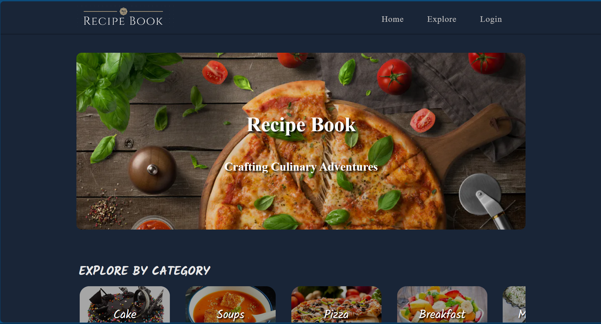
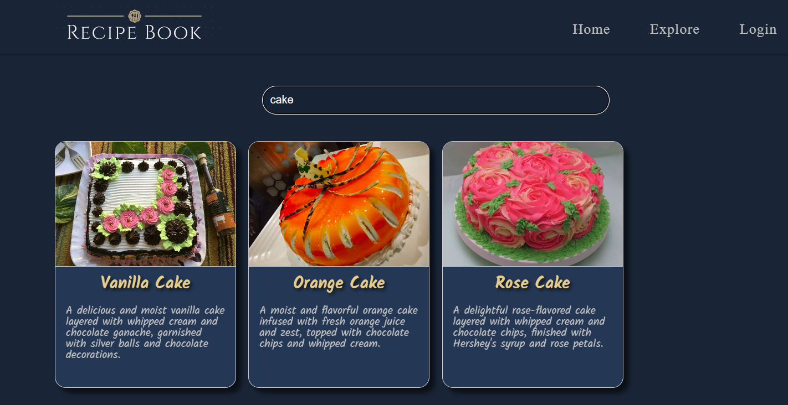
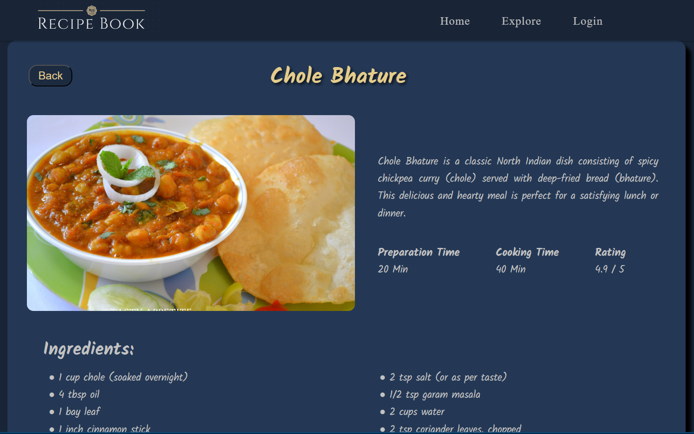
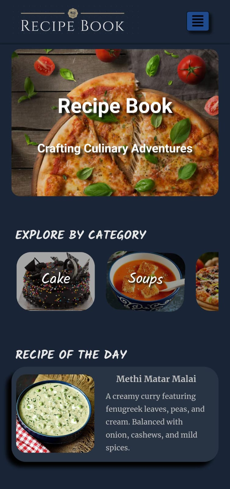
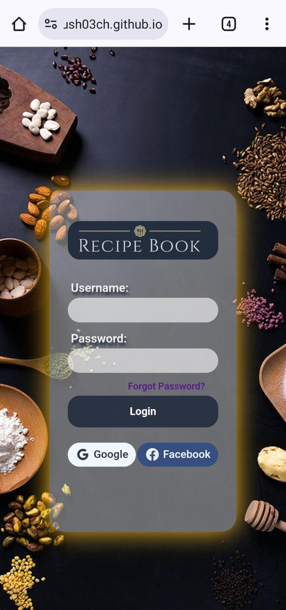
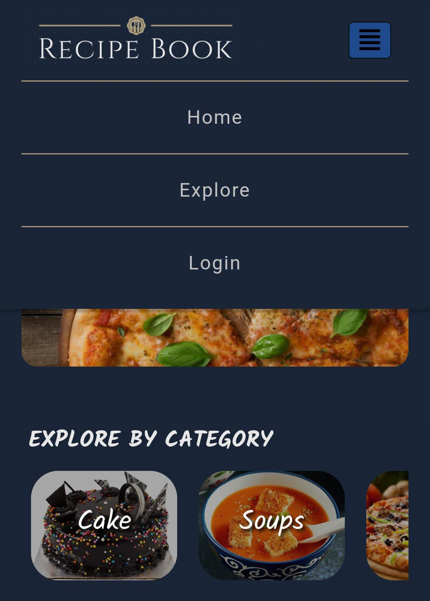

# Recipe Book Website  
Welcome to the Recipe Book Website repository! This repository contains the source code for a web application designed to showcase a collection of delicious recipes.   

## About  
The Recipe Book Website is a project aimed at providing users with a convenient platform to explore various recipes. Whether you're a cooking enthusiast or just looking for some culinary inspiration, this website has something for everyone.

## Features  
Browse a wide range of recipes categorized by cuisine, meal type, or dietary preferences.  
Search functionality to quickly find your favorite recipes.  
Detailed recipe pages with ingredients, instructions, and cooking tips.  
User-friendly interface with intuitive navigation.  
Responsive design for seamless access on desktop and mobile devices.  

## Technologies Used  
HTML  
CSS  
JavaScript  
Angular  

## Getting Started
To run the website on github server click the link https://ayush03ch.github.io/Recipe-Book/  
*Sample Images from the website*  
*Layout responsible for all screen sizes*  






  
To run the Recipe Book Website locally on your machine, follow these steps:  

1) Clone this repository to your local machine using git clone https://github.com/ayush03ch/Recipe-Book.git.  
2) Navigate to the project directory: cd Recipe-Book.  
3) Install the necessary dependencies by running: ```npm install```.  
4) Once the dependencies are installed, start the development server with ng serve.  
   or run the command: ```node runner.js```
6) Open your web browser and visit  'localhost'  to view the website.
   
## Contributing
Contributions are welcome! If you have any ideas for new features, improvements, or bug fixes, feel free to submit a pull request. Please adhere to the code of conduct and follow the contribution guidelines.
